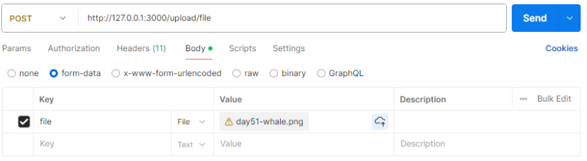
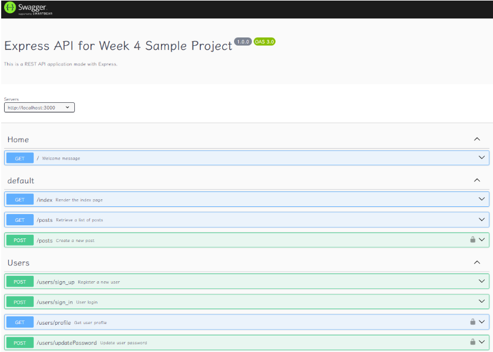

## Express-Full-stack-development

 開發一個類似IG貼文系統，具備登入、新增貼文、按讚....等功能

 ### 目前具備 
 
 1. JWT認證
 2. 新增貼文
 3. 登入功能
 4. 修改個人資料

### 範例登入

```
{
    "email":"xinag12345@gmail.com",
    "password":"xiang1234"
}
```

### 範例註冊
```
{
    "name":"xiang5",
    "email":"xinag12345@gmail.com",
    "confirmPassword":"xiang123",
    "password":"xiang123"
   
}
```
### 更新密碼
> [!TIP]
> 要先進行登入驗證 -> Cookies -> JWT 

postman 右側查看程式碼取得 ```Token```

```
{
    "password":"xiang1234",
    "confirmPassword":"xiang1234"    
}
```

### 新增貼文

> [!TIP]
> 要先進行登入驗證 -> Cookies -> JWT 

```
{
    "content":"hi 大家 11/30"
}
```

### 上傳照片



### Swagger

```
/api-docs/
```

